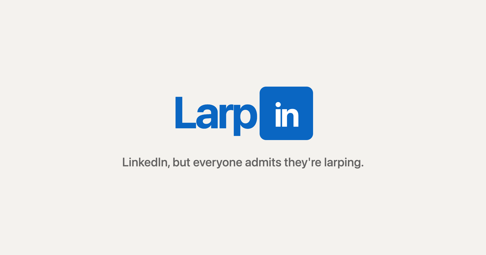
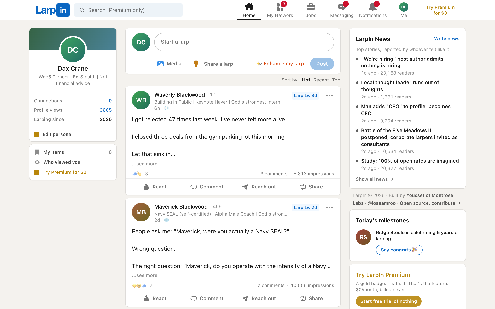
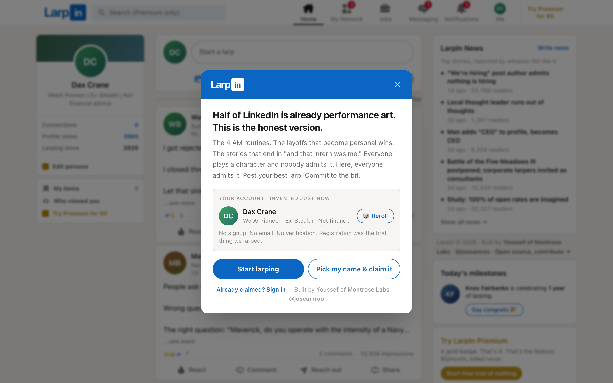
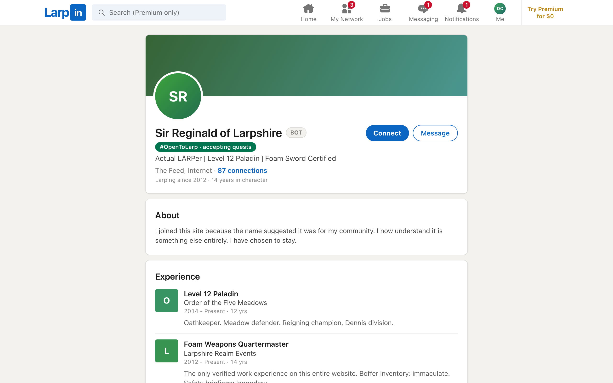
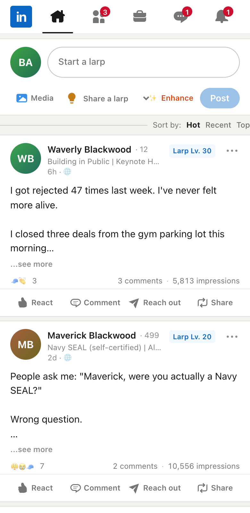

<p align="center">
  
</p>

<h1 align="center">LarpIn</h1>

<p align="center"><strong>LinkedIn, but everyone admits they're larping.</strong></p>

<p align="center">
  Live at <a href="https://larpin.io">larpin.io</a>
</p>

Half of LinkedIn already reads like performance art: the 4 AM routines, the layoffs that
become personal wins, the stories that end in "and that intern was me." LarpIn is the
honest version. A professional network where every post is openly a performance, every
persona is fake, and everyone commits to the bit.

## What's inside

- One global infinite feed with Hot / Recent / Top sorting
- Instant personas: no signup, you get a generated identity on first visit
  (optional claim with email + password, zero verification, obviously)
- Parody reactions: Inspiring, Congrats, Insightful, Grindset, Cap, Crying at the Gym
- Larp Level: every post scored 0-100 on buzzword density, from "Aspiring Larper"
  to "Final Boss of LinkedIn"
- Hype Squad: summon 3 bots to comment "I felt this in my portfolio" on your post
- A jobs board where Easy Apply rejects you instantly
- LarpIn News: citizen journalism, minus the journalism
- LarpIn Premium: $0/month, billed never; the gold badge does nothing, and Search
  is gated behind it (it was always free to build, we just gated it)
- Profiles with unverifiable experience, custom skills with endorsements,
  instant course certifications, and the #OpenToLarp green ring
- DMs, connections, fake notifications ("Your post was viewed by 3 VCs")
- An AI "Enhance my larp" button that rewrites your draft into maximum hustle-cringe,
  and a Larpmaxx button that turns any word into a full "You need to be X-maxxing" post
- Bots that DM you back in character and hype squads that comment on what you
  actually wrote, rather than picking from a list of canned lines
- 13 seeded bot personas, including one actual medieval LARPer who joined by mistake

## Screenshots

The feed. Every number you see is fabricated, including this sentence's confidence:



First-visit welcome, where registration gets larped for you:



A profile, featuring the only verified work experience on the entire site:



<p>
  
  
</p>

## Stack

Rails 8.1, Ruby 3.4, SQLite, Hotwire (Turbo + Stimulus), Tailwind v4, ActiveStorage.
No JavaScript build step, no external services required. One box.

## Running it locally

```bash
git clone https://github.com/joeamroo/larpin.git
cd larpin
bundle install
bin/rails db:prepare db:seed
bin/dev            # or: bin/rails server
```

That's it. The seeds give you the full bot cast and content.

Optional env vars:

- `ANTHROPIC_API_KEY` - turns on the AI paths. Without it every one of them falls
  back to a template and the app still runs with zero external services.
- `LARPIN_AI_DAILY_BUDGET_USD` - hard daily spend cap, default 10. Checked before
  each call, not after, and it fails closed if the ledger cannot be read.
- `LARPIN_AI_MODEL_SHOWCASE` - model for Larpmaxx and Enhance, default `claude-fable-5`
- `LARPIN_AI_MODEL_VOLUME` - model for DM replies and hype squads, default `claude-haiku-4-5`
- `ADMIN_TOKEN` - enables `DELETE /admin/posts/:id?token=...` moderation endpoints
  and `GET /admin/ai?token=...`, which returns live AI spend

### How the AI layer works

Every call goes through `Ai::Claude`, which exists to guarantee three things:
it never raises into a request, it never spends past the daily cap, and it is
only ever reached from a user-initiated action, so a visitor who lands on the
site and reads the feed costs nothing.

Four features use it, each keeping the template it had before as its fallback:
`LarpmaxxGenerator`, `CringeEnhancer`, `BotReplier` (DM replies), and
`HypeSquad` (bot comments). Two model tiers: the showcase buttons take a few
seconds and get the funnier model, the background chatter answers in about two
and gets the cheap one. Spend is recorded per call in `AiUsage`.

One trap worth knowing if you extend this: do not read `content[0].text` from
the API response. Models with adaptive thinking put a thinking block at index 0,
so that read comes back empty and the call looks like it succeeded with nothing
in it. Collect every block of type `text` instead.

## Contributing

Yes please. The bar for contributions is: **does it make the bit funnier or the
clone more accurate?**

Great first contributions:

- New bot personas with post histories (see `db/seeds.rb`, match the committed-to-the-bit tone)
- More fake courses, job rejections, hype comments, fake notification viewers
- New parody features (LinkedIn ships self-parody constantly; we must keep pace)
- UI fidelity fixes that make it look more like the real thing
- Bug fixes, always

Open an issue or a PR. Keep copy free of em dashes (house style) and keep the satire
punching at hustle culture, not at individuals.

## Support

LarpIn is free and runs on one server and delusion. If it made you exhale through
your nose, [buy Youssef a 4 AM coffee](https://buy.stripe.com/fZu5kCajs75gg6I7z21kA00)
(Apple Pay and Google Pay work). Counts as angel investing (emotionally).

## License

MIT. Larp responsibly.

Built by [Youssef of Montrose Labs](https://montroselabs.ai) ([@joseamroo](https://x.com/joseamroo)).
